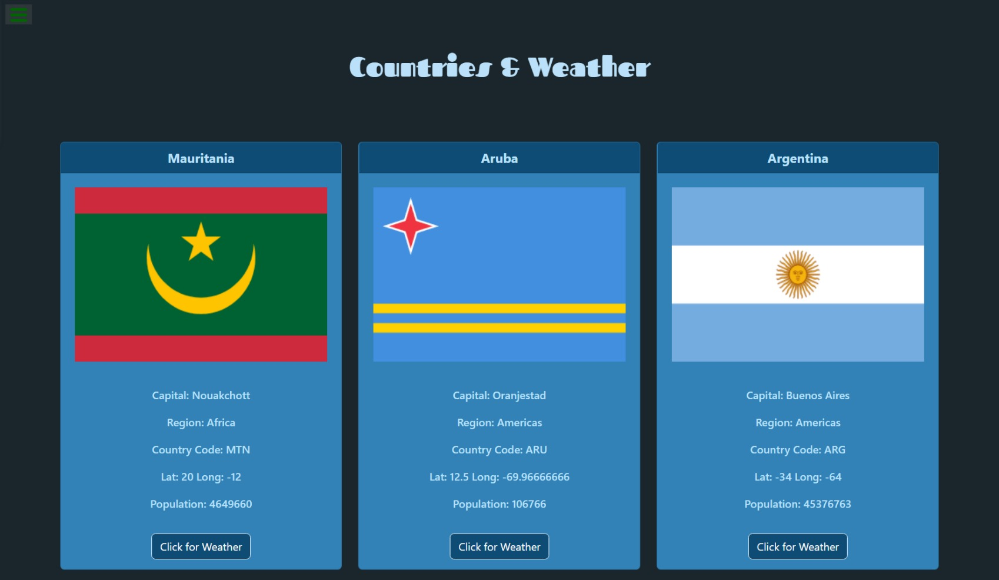

# Rest Countries and Weather using fetch API

## Table of contents

- [Overview](#overview)
  - [Screenshot](#screenshot)
  - [Links](#links)
- [My process](#my-process)
  - [Built with](#built-with)
  - [What I learned](#what-i-learned)
  - [Useful resources](#useful-resources)
- [Author](#author)

## Overview

This is a basic website which lists all the major countries and also shows the exact weather of the location. It is built on HTML, CSS, Javascript, Bootstrap. Used DOM Maipulation for creating HTML elements and fetch() API to retrieve data from the resources given below.

### Screenshot



### Links

- Solution URL: [https://github.com/DwarakanathAkkala/RestCountries-And-Weather]
- Live Site URL: [https://rest-countries-and-weather.netlify.app/]

## My process

### Built with

- HTML
- DOM Manipulation
- CSS custom properties
- Flexbox
- Mobile-first workflow
- fetch() API

### What I learned

```html
<div class="card-text">
  <p>Capital: ${objData.capital == undefined ? "N/A" : objData.capital}</p>
  <p>Region: ${objData.region}</p>
  <p>Country Code: ${objData.cioc ? objData.cioc : "N/A"}</p>
  <p>
    Lat: ${objData.latlng == undefined ? "N/A" : objData.latlng[0]} Long:
    ${objData.latlng ==undefined ? "N/A" : objData.latlng[1]}
  </p>
  <p>Population: ${objData.population}</p>
</div>
```

```CSS - Added Compatibilty for all types of devices
@media screen and (min-width: 768px) and (min-height: 1024px) {
    .card-img-top {
        height  : 20vh;
    }
}
```

### Useful resources

- [https://restcountries.com/v3.1/all] - This helped me for fetching all the Countries Data with Latitude and Longitudes.
- [https://api.openweathermap.org/data/2.5/weather] - This is an amazing API where we can get the latest weather data using the latitude and longitude of locations.

## Author

- LinkedIN - [@Dwarakanath AKkala](https://www.linkedin.com/in/dwarakanath-akkala-77a849136/)
- GITHub - [@DwarakanathAKkala](https://github.com/DwarakanathAkkala)
